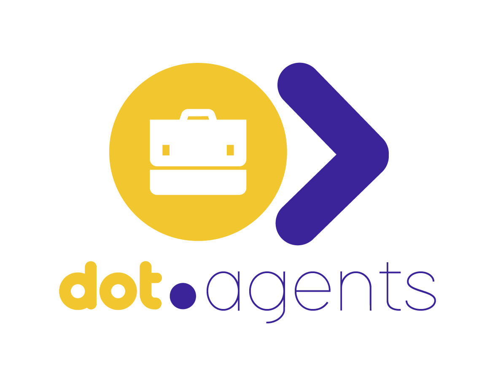

<div align="center">



<br /><br />

**Hire, deploy, and govern AI agents as digital workforce members.**

<br />

   

<br /><br />

**Part of the [InfoDot Ecosystem](https://github.com/sakhileb/InfoDot)** &nbsp;·&nbsp; `agents.infodot.app`

</div>

---

## What is Dot.Agents?

Dot.Agents is a multi-tenant SaaS platform that lets organisations hire, deploy, monitor, and govern specialised AI agents as digital workforce members. Every agent decision is auditable, every deployment runs under an enforced confidence threshold and approval mode, and a background Digital Immune System watches for drift, failure spikes, and security anomalies. See [`wiki.md`](wiki.md) for the full architecture.

## Core Features

- Agent marketplace and deployment — hire an agent type, configure its deployment mode and confidence threshold
- Task execution with full audit trail — every AI decision is logged, scored, and reviewable
- Delusion-risk scoring and human-in-the-loop approval workflow for higher-risk decisions
- Digital Immune System — automatic suspension of deployments on failure/drift/security breach
- 10-dimension agent scorecards, computed per agent per period
- Visual multi-step agent workflow builder
- Social-channel agents — publishing, inbox triage, sentiment, and lead qualification
- Prism PHP-mediated, provider-agnostic AI orchestration (OpenAI → Anthropic → Google AI → local Ollama failover)
- Ecosystem SSO from the wider InfoDot/Dot hub

## Domain Models

- **Agent / AgentVersion** — marketplace catalog entry (an agent type, not tenant-owned)
- **AgentDeployment** — an organisation's hired, configured instance of an agent
- **AgentTask** — a unit of work executed by a deployment, with confidence, latency, cost, and token tracking
- **AgentSession / AgentMessage** — threaded conversation history per deployment
- **AgentApproval / DecisionLog** — the human-in-the-loop approval workflow and delusion-risk-scored decision record
- **AgentScorecard** — the 10-dimension agent health score
- **AuditLog / SecurityEvent** — the append-only governance and security event trail

40 models in total — see [`docs/architecture/database-schema.md`](docs/architecture/database-schema.md).

## Tech Stack

| Layer | Technology |
|---|---|
| Framework | Laravel 12 |
| Language | PHP 8.4 |
| Frontend | Livewire 3 · Alpine.js 3 · Tailwind CSS |
| Database | SQLite (dev) / MySQL 8+ (prod) · Redis (cache + queue) |
| Auth | Laravel Jetstream · Sanctum (ecosystem SSO handoff) |
| AI orchestration | Prism PHP — provider-agnostic (OpenAI, Anthropic, Google AI, Ollama) |
| Queue | Redis · Laravel Horizon |

## Quick Start

```bash
git clone https://github.com/sakhileb/Dot.Agents.git
cd Dot.Agents
cp .env.example .env
composer install
npm install && npm run build
php artisan key:generate
php artisan migrate
php artisan serve
```

> **Ecosystem SSO:** Set `APP_URL=https://agents.infodot.app`. Users authenticated through the InfoDot hub gain access automatically via Sanctum handoff tokens (`EcosystemAuthController`).

## Ecosystem

**Dot.Agents** is one of **21 platforms** in the InfoDot ecosystem, connected via shared PostgreSQL and Sanctum SSO. Visit [InfoDot](https://github.com/sakhileb/InfoDot) to explore the full platform map.

## License

MIT © [SK Digital / BluPin Incorporated](https://github.com/sakhileb)
